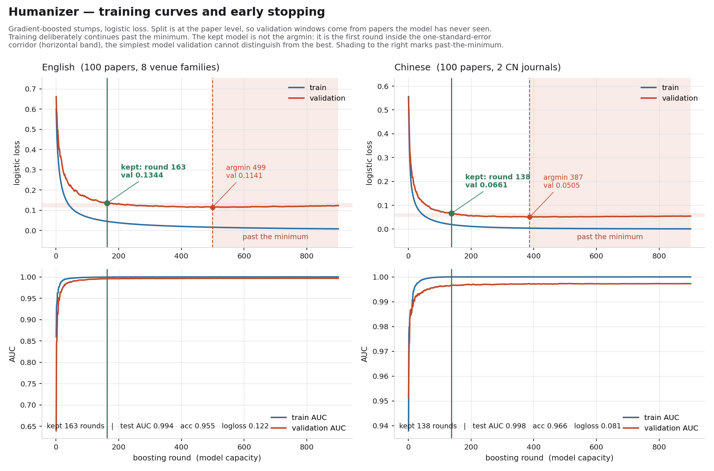
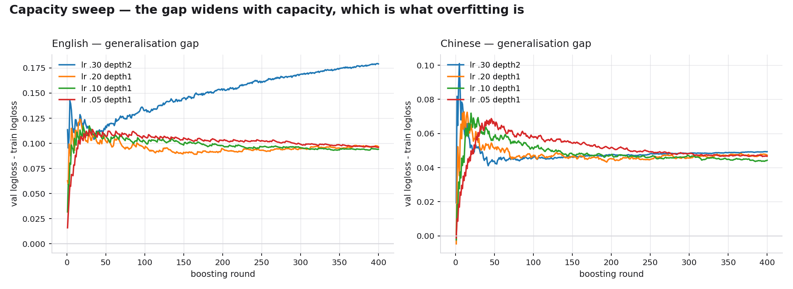

# Humanizer

**English**

A bilingual (中文 / English) instrument for **repairing AI-drafted academic prose**: it measures
how far each passage sits from published human writing, names the exact features responsible,
and prescribes the rewrite.

This repository holds the methodology, the trained model coefficients, the measured reference
bands, the training record, and the figures. The skill source lives in a private companion
repository, `humanizer_formal_claude-core`.

> **2026-09-17.** The skill is now named `humanizer-formal` and handles academic manuscripts only;
> this repository was `humanizer_claude` (GitHub redirects the old URL). Everyday prose is a separate
> skill, `humanizer-informal`, with no model behind it. The model, the bands and every figure below
> are unchanged. The repair protocol gained one mechanical step: a before/after check that every
> number, statistic, citation and quoted string survived the rewrite.

---

**中文**

一个中英双语的**AI 论文文本修复**仪器：测量每一段落离已发表人类学术散文有多远，指出**具体是哪些特征**
造成的，并给出对应的改写处方。

本仓库存放方法学、训练出的模型系数、实测参考带、完整训练记录与图表。skill 源码在私有配套仓库
`humanizer_formal_claude-core`。

> **2026-09-17：** skill 现名 `humanizer-formal`，只处理学术稿件；本仓库原名 `humanizer_claude`（旧链接由 GitHub 自动跳转）。
> 日常文字另有独立的 `humanizer-informal`，不带模型。模型、参考带与下文所有数字均未改动；
> 修复流程新增一步机械校验：改写前后逐项比对数字、统计量、引用与引文是否完整保留。

---

## What it is / 它是什么

**English**

A **generalised additive model** — a sum of one-feature step functions, boosted decision
stumps under logistic loss — over 45 (English) / 48 (Chinese) interpretable stylometric
features. Depth-1 trees are not a compromise here; they are the point. Because the model is
additive, every score decomposes *exactly* into the features that produced it, which is what
lets a flagged passage arrive with a reason rather than a plausible-sounding guess.

Implemented in numpy. No torch, no scikit-learn, no network, no text leaves the machine.

**中文**

一个**广义可加模型**（GAM）——逻辑损失下提升的深度 1 决策树桩——建立在 45 个（英文）/ 48 个（中文）
可解释的文体计量特征之上。用深度 1 不是妥协，而是设计核心：模型可加，意味着任何一个分数都能**精确**
分解到产生它的那些特征上。这是"告诉你该改什么"能够成立、而不只是听起来像回事的唯一理由。

纯 numpy 实现。不需要 torch，不需要 scikit-learn，不联网，文本不出本机。

## What it measures, and what it does not / 它测量什么，不测量什么

**English**

`p_machine` separates two measured populations:

- **human** — sliding windows from 200 papers (100 English, 100 Chinese) published before
  2022-11-30, i.e. prose that cannot contain generated text;
- **machine** — windows from LLM-written passages on the same 200 titles, produced without
  sight of the human text.

**It is not evidence of authorship.** On held-out data, **9.8% of windows from real published
English papers and 4.2% from real published Chinese papers score above 0.5.** One high window
proves nothing. There is no such quantity as an "AI percentage".

**中文**

`p_machine` 区分的是两个**实测**总体：

- **人类**——200 篇 2022-11-30 之前发表的论文（100 中 + 100 英）的滑动窗口，即不可能含生成文本的散文；
- **机器**——同样这 200 个标题下由 LLM 撰写的段落，生成时没有看过人类原文。

**它不是作者身份的证据。** 在留出数据上，**9.8% 的真实已发表英文论文窗口、4.2% 的真实已发表中文论文
窗口分数高于 0.5。** 单个高分窗口什么都不能说明。不存在"AI 百分比"这种量。

## Results / 结果

**English**

| | English | Chinese |
|---|---|---|
| Human papers | 100 (8 venue families) | 100 (软件学报 53, 计算机系统应用 47) |
| Features | 45 | 48 |
| Windows (train / val / test), human+machine | 720+789 / 240+264 / 240+267 | 711+765 / 238+262 / 237+264 |
| Rounds trained → kept | 900 → **163** | 900 → **120** |
| Validation argmin | 499 | 375 |
| Held-out test AUC | **0.994** | **0.998** |
| Test accuracy | 0.955 | 0.970 |
| Human false-positive floor | 9.8% | 4.2% |

Full record, including the capacity sweep and per-feature contributions:
[`docs/TRAINING-REPORT.md`](docs/TRAINING-REPORT.md).

**中文**

| | 英文 | 中文 |
|---|---|---|
| 人类论文 | 100 篇（8 个会议/期刊族） | 100 篇（软件学报 53、计算机系统应用 47） |
| 特征数 | 45 | 48 |
| 窗口数（训练/验证/测试，人+机） | 720+789 / 240+264 / 240+267 | 711+765 / 238+262 / 237+264 |
| 训练轮数 → 保留 | 900 → **163** | 900 → **120** |
| 验证损失最低点 | 499 | 375 |
| 留出测试 AUC | **0.994** | **0.998** |
| 测试准确率 | 0.955 | 0.970 |
| 人类假阳性基线 | 9.8% | 4.2% |

完整记录（含容量扫描与逐特征贡献）：[`docs/TRAINING-REPORT.md`](docs/TRAINING-REPORT.md)。

## Early stopping, and why the kept model is not the argmin / 早停：为什么保留的不是最低点

**English**

Training runs 900 rounds on purpose — far past the point of usefulness — so the stopping round
is *measured* rather than asserted. The validation curve reaches its minimum at round 499
(English) / 375 (Chinese) and rises afterwards.

The shipped model is nevertheless **round 163 / 120**: the first round whose validation loss
falls inside **one standard error** of the minimum. Taking the exact argmin selects on
validation noise, and this corpus shows exactly why — an earlier Chinese run left to find its
argmin kept "improving" in the fourth decimal for another 1,700 rounds while its **held-out
test loss got worse**. The one-standard-error rule returns the simplest model the validation
set cannot distinguish from the best, at roughly a third of the capacity.

**中文**

训练故意跑满 900 轮——远超有用的范围——好让停止的轮次是**测出来的**而不是宣称的。验证曲线在第
499 轮（英文）/ 375 轮（中文）触底，之后回升。

但发布的模型是**第 163 / 120 轮**：验证损失首次落入最低点**一倍标准误**之内的那一轮。取精确的最低点
等于在对验证噪声做选择，而这份语料恰好给出了教科书式的反例——中文侧一次放任它去找最低点的运行，
在之后的 1700 轮里持续在第四位小数上"改善"，而**留出测试损失反而变差了**。一倍标准误规则返回的是
"验证集分辨不出它和最优有什么区别"的最简模型，容量只有三分之一。

## Confounds that were controlled, not exploited / 被控制掉的混淆，而不是被利用的混淆

**English**

Four measurements separate the two corpora almost perfectly, and all four are **deliberately
excluded** from the feature set:

| Excluded | Why it had to go |
|---|---|
| citation markers | a synthetic passage has no bibliography (Cohen's *d* was −1.8) |
| parentheses | dominated by glosses, cross-references and `(N=24)` (*d* was −2.0) |
| quotation marks | a synthetic passage quotes no participants |
| acronyms / proper nouns | a synthetic passage invents generic system and dataset names |

A real AI-drafted manuscript has all four, because the author supplies them. A model trained on
them would learn *has a bibliography, therefore human* — a classifier with a beautiful AUC and
no use whatsoever. Citation markers are additionally stripped from **both** sides before any
feature is computed.

One further correction is recorded rather than hidden: the first machine corpus was generated
under a prompt that told the model not to hedge, which suppressed hedge density on the machine
side and **inverted the sign** of a feature that matters. A second corpus was generated under a
neutral prompt. Both are kept — they are two registers an LLM actually produces — and the
machine class is down-weighted to parity. Repair advice is keyed to the direction measured in
the data, never to a hardcoded assumption about which way generated prose deviates.

**中文**

有四个测量能几乎完美地分开两个语料，而这四个全部被**刻意排除**在特征集之外：

| 排除项 | 为什么必须排除 |
|---|---|
| 引文标记 | 合成段落没有参考文献（Cohen's *d* 曾为 −1.8） |
| 括号 | 主要由缩写解释、交叉引用和 `(N=24)` 贡献（*d* 曾为 −2.0） |
| 引号 | 合成段落不引用被试原话 |
| 缩略语 / 专名 | 合成段落只会编造泛化的系统名和数据集名 |

真实的 AI 起草论文这四样全都有，因为作者会补上。拿它们训练只会得到一个"有参考文献所以是人写的"
分类器——AUC 很漂亮，但毫无用处。引文标记还会在计算任何特征**之前**从两侧同时剥离。

还有一处修正是被记录下来而不是被藏起来的：第一版机器语料的生成提示里写了"不要含糊其辞"，
这**压低了机器侧的模糊限制语密度并让这个特征的符号反了向**。于是又用中性提示生成了第二版。两版
都保留——它们是 LLM 真实会产出的两种语域——机器类整体降权到与人类类持平。修复建议的方向一律取自
数据实测，绝不写死"生成文本一定偏高/偏低"。

## What the model found / 模型发现了什么

**English**

Top features by total contribution, with the direction measured on the training split:

**English** — `rare_token_share`, `enum_per_1k` (i.e./e.g. glosses), `ttr`, `digit_per_1k`,
`sent_len_skew`, `sent_initial_connective_rate`.

**Chinese** — `rare_token_share`, `ttr`, `first_person_per_1k`, `light_verb_per_1k`
(进行 / 实现 / 具有), `sent_len_cv`, `number_unit_per_1k`, `four_char_rate`.

Two results run against the folk account of "AI writing":

1. **Type-token ratio is higher in generated prose, not lower.** Published academic writing is
   repetitive on purpose — a defined term keeps its name — while generated prose reaches for a
   fresh synonym. `hapax_share` moves the same way.
2. **Number density is the most reliable tell and the least visible on a read-through.**
   Generated prose is fluent and specific-*sounding*; then you count the numbers and there are
   none. Median `digit_per_1k` in the flagged English passages is 0, against a human median
   of 49.

**中文**

按总贡献排序的头部特征（方向为训练集上实测）：

**英文**——`rare_token_share`、`enum_per_1k`（i.e./e.g. 插入解释）、`ttr`、`digit_per_1k`、
`sent_len_skew`、`sent_initial_connective_rate`。

**中文**——`rare_token_share`、`ttr`、`first_person_per_1k`、`light_verb_per_1k`（进行/实现/具有）、
`sent_len_cv`、`number_unit_per_1k`、`four_char_rate`。

其中两条与流行说法相反：

1. **词汇丰富度（TTR）在生成文本里是偏高的，不是偏低。** 已发表学术写作是**刻意重复**的——一个定义过
   的术语会一直用同一个名字——而生成文本不断去换同义词。`hapax_share` 同向。
2. **数字密度是整套特征里最可靠、也最难在通读时发现的信号。** 生成文本读起来流畅、听起来具体；
   然后你去数数字，一个都没有。被标红的英文段落里 `digit_per_1k` 的中位数是 0，人类中位数是 49。

## Corpus / 语料

**English**

Papers are identified, never redistributed.

- **English** — 100 arXiv papers with a confirmed mainstream venue (24 from `journal_ref`, 76
  from an acceptance statement in the author comment), spanning HCI, NLP, CV, ML, IR/DM,
  systems/SE, security, and robotics/graphics. All v1 before 2022-11-30.
- **Chinese** — 100 papers from two open-access journals, 2019–2021 issues only:
  软件学报 (Journal of Software, CCF-A 中文期刊) and 计算机系统应用.
  **CNKI and Wanfang were not touched**: their full text is licensed, and scraping it would
  breach that licence regardless of technical feasibility.

Identifiers are in [`data/manifest_en.json`](data/manifest_en.json) and
[`data/manifest_zh.json`](data/manifest_zh.json), so the corpus is reproducible by anyone with
access to the same open sources.

**中文**

论文只做标识，不做再分发。

- **英文**——100 篇有确认发表 venue 的 arXiv 论文（24 篇来自 `journal_ref`，76 篇来自作者 comment 里的
  录用声明），覆盖 HCI、NLP、CV、ML、IR/DM、系统/软工、安全、机器人/图形学。v1 全部早于 2022-11-30。
- **中文**——100 篇来自两个开放获取期刊，只取 2019–2021 年的期：
  软件学报（CCF-A 中文期刊）与计算机系统应用。
  **没有碰知网和万方**：它们的全文是授权内容，无论技术上是否可行，抓取都违反授权。

标识清单见 [`data/manifest_en.json`](data/manifest_en.json) 与
[`data/manifest_zh.json`](data/manifest_zh.json)，任何能访问同样开放源的人都可以复现这份语料。

## Limits / 局限

**English**

- The Chinese band is a **computer-science** register from two journals, not Chinese academic
  writing in general. A humanities or medical manuscript needs a band rebuilt from that
  literature.
- The English side is the arXiv rendering of published papers, not the publisher's typeset copy.
- The machine class is one model family at one point in time. It will drift. The feature
  extractor carries a version that the scorer checks at load time and **refuses to score on a
  mismatch** rather than silently producing meaningless numbers.
- The Chinese model separates its own corpus almost perfectly (test AUC 0.998), which means its
  held-out band is narrow and it is more likely than the English model to be over-confident on
  prose from outside the corpus.
- `rare_token_share` is measured against a 4,000-token common core fit on the training papers.
  A manuscript from a distant subfield will sit high on it for reasons that are not register.
- **Nothing here establishes authorship.**

**中文**

- 中文参考带是**计算机学科**的语域、且只来自两个期刊，不代表"中文学术写作"整体。人文或医学稿件
  应当用那一片文献重建参考带。
- 英文侧是已发表论文的 arXiv 版本，不是出版社的排版版本。
- 机器类只来自某一时刻的一个模型族，它会漂移。特征提取器带版本号，打分器在加载时校验，
  **不匹配就拒绝打分**，而不是静默给出无意义的数字。
- 中文模型在自己的语料上几乎完美可分（测试 AUC 0.998），这意味着它的留出带很窄，
  在语料之外的文本上比英文模型更容易过度自信。
- `rare_token_share` 是对着训练论文拟合出的 4000 词常用核心衡量的。来自较远子领域的稿件会在这个
  特征上偏高，而原因与语域无关。
- **这里没有任何东西能确立作者身份。**

## Licence / 许可

**English**

Skill source: not published here; see [`LICENSE`](LICENSE).
Measurements, models and figures in `data/` and `docs/media/`: CC BY 4.0, see
[`LICENSE-DATA`](LICENSE-DATA).

**中文**

skill 源码不在此发布，见 [`LICENSE`](LICENSE)。
`data/` 与 `docs/media/` 下的测量结果、模型与图表按 CC BY 4.0 发布，见 [`LICENSE-DATA`](LICENSE-DATA)。
