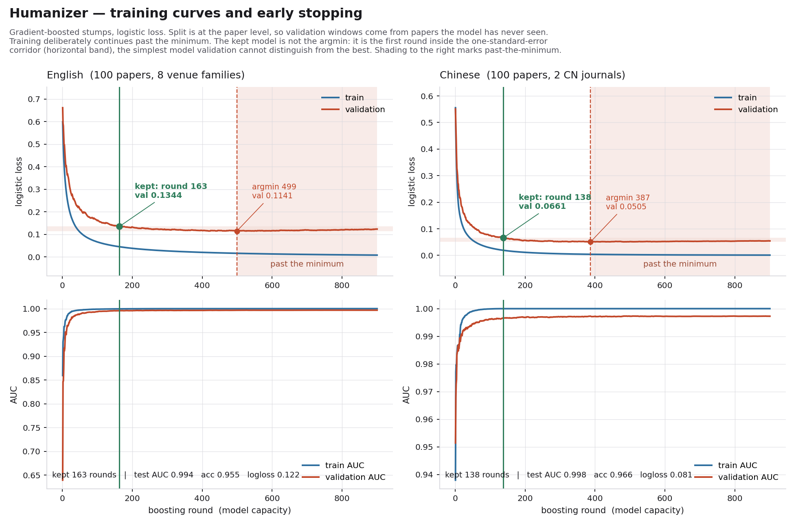
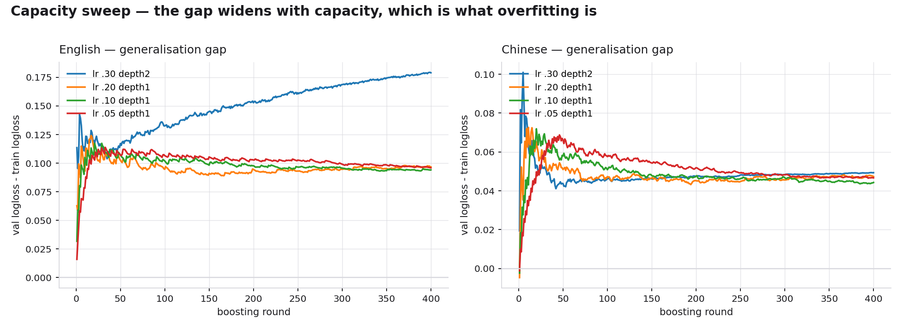

# Humanizer

[English](README.md) | **中文**

一个中英双语的**AI 论文文本修复**仪器：测量每一段落离已发表人类学术散文有多远，指出**具体是哪些特征**
造成的，并给出对应的改写处方。

本仓库存放方法学、训练出的模型系数、实测参考带、完整训练记录与图表。skill 源码在私有配套仓库
`humanizer_formal_claude-core`。

> **2026-09-17：** skill 现名 `humanizer-formal`，只处理学术稿件；本仓库原名 `humanizer_claude`（旧链接由 GitHub 自动跳转）。
> 日常文字另有独立的 `humanizer-informal`，不带模型。模型、参考带与下文所有数字均未改动；
> 修复流程新增一步机械校验：改写前后逐项比对数字、统计量、引用与引文是否完整保留。

---

## 它是什么

一个**广义可加模型**（GAM）——逻辑损失下提升的深度 1 决策树桩——建立在 45 个（英文）/ 48 个（中文）
可解释的文体计量特征之上。用深度 1 不是妥协，而是设计核心：模型可加，意味着任何一个分数都能**精确**
分解到产生它的那些特征上。这是"告诉你该改什么"能够成立、而不只是听起来像回事的唯一理由。

纯 numpy 实现。不需要 torch，不需要 scikit-learn，不联网，文本不出本机。

## 它测量什么，不测量什么

`p_machine` 区分的是两个**实测**总体：

- **人类**——200 篇 2022-11-30 之前发表的论文（100 中 + 100 英）的滑动窗口，即不可能含生成文本的散文；
- **机器**——同样这 200 个标题下由 LLM 撰写的段落，生成时没有看过人类原文。

**它不是作者身份的证据。** 在留出数据上，**9.8% 的真实已发表英文论文窗口、4.2% 的真实已发表中文论文
窗口分数高于 0.5。** 单个高分窗口什么都不能说明。不存在"AI 百分比"这种量。

## 结果

| | 英文 | 中文 |
|---|---|---|
| 人类论文 | 100 篇（8 个会议/期刊族） | 100 篇（软件学报 53、计算机系统应用 47） |
| 特征数 | 45 | 48 |
| 窗口数（训练/验证/测试，人+机） | 720+789 / 240+264 / 240+267 | 711+765 / 238+262 / 237+264 |
| 训练轮数 → 保留 | 900 → **163** | 900 → **120** |
| 验证损失最低点 | 499 | 375 |
| 留出测试 AUC | **0.994** | **0.998** |
| 测试准确率 | 0.955 | 0.970 |
| 人类假阳性基线 | 9.8% | 4.2% |

完整记录（含容量扫描与逐特征贡献）：[`docs/TRAINING-REPORT.md`](docs/TRAINING-REPORT.md)。

## 早停：为什么保留的不是最低点

训练故意跑满 900 轮——远超有用的范围——好让停止的轮次是**测出来的**而不是宣称的。验证曲线在第
499 轮（英文）/ 375 轮（中文）触底，之后回升。

但发布的模型是**第 163 / 120 轮**：验证损失首次落入最低点**一倍标准误**之内的那一轮。取精确的最低点
等于在对验证噪声做选择，而这份语料恰好给出了教科书式的反例——中文侧一次放任它去找最低点的运行，
在之后的 1700 轮里持续在第四位小数上"改善"，而**留出测试损失反而变差了**。一倍标准误规则返回的是
"验证集分辨不出它和最优有什么区别"的最简模型，容量只有三分之一。

## 被控制掉的混淆，而不是被利用的混淆

有四个测量能几乎完美地分开两个语料，而这四个全部被**刻意排除**在特征集之外：

| 排除项 | 为什么必须排除 |
|---|---|
| 引文标记 | 合成段落没有参考文献（Cohen's *d* 曾为 −1.8） |
| 括号 | 主要由缩写解释、交叉引用和 `(N=24)` 贡献（*d* 曾为 −2.0） |
| 引号 | 合成段落不引用被试原话 |
| 缩略语 / 专名 | 合成段落只会编造泛化的系统名和数据集名 |

真实的 AI 起草论文这四样全都有，因为作者会补上。拿它们训练只会得到一个"有参考文献所以是人写的"
分类器——AUC 很漂亮，但毫无用处。引文标记还会在计算任何特征**之前**从两侧同时剥离。

还有一处修正是被记录下来而不是被藏起来的：第一版机器语料的生成提示里写了"不要含糊其辞"，
这**压低了机器侧的模糊限制语密度并让这个特征的符号反了向**。于是又用中性提示生成了第二版。两版
都保留——它们是 LLM 真实会产出的两种语域——机器类整体降权到与人类类持平。修复建议的方向一律取自
数据实测，绝不写死"生成文本一定偏高/偏低"。

## 模型发现了什么

按总贡献排序的头部特征（方向为训练集上实测）：

**英文**——`rare_token_share`、`enum_per_1k`（i.e./e.g. 插入解释）、`ttr`、`digit_per_1k`、
`sent_len_skew`、`sent_initial_connective_rate`。

**中文**——`rare_token_share`、`ttr`、`first_person_per_1k`、`light_verb_per_1k`（进行/实现/具有）、
`sent_len_cv`、`number_unit_per_1k`、`four_char_rate`。

其中两条与流行说法相反：

1. **词汇丰富度（TTR）在生成文本里是偏高的，不是偏低。** 已发表学术写作是**刻意重复**的——一个定义过
   的术语会一直用同一个名字——而生成文本不断去换同义词。`hapax_share` 同向。
2. **数字密度是整套特征里最可靠、也最难在通读时发现的信号。** 生成文本读起来流畅、听起来具体；
   然后你去数数字，一个都没有。被标红的英文段落里 `digit_per_1k` 的中位数是 0，人类中位数是 49。

## 语料

论文只做标识，不做再分发。

- **英文**——100 篇有确认发表 venue 的 arXiv 论文（24 篇来自 `journal_ref`，76 篇来自作者 comment 里的
  录用声明），覆盖 HCI、NLP、CV、ML、IR/DM、系统/软工、安全、机器人/图形学。v1 全部早于 2022-11-30。
- **中文**——100 篇来自两个开放获取期刊，只取 2019–2021 年的期：
  软件学报（CCF-A 中文期刊）与计算机系统应用。
  **没有碰知网和万方**：它们的全文是授权内容，无论技术上是否可行，抓取都违反授权。

标识清单见 [`data/manifest_en.json`](data/manifest_en.json) 与
[`data/manifest_zh.json`](data/manifest_zh.json)，任何能访问同样开放源的人都可以复现这份语料。

## 局限

- 中文参考带是**计算机学科**的语域、且只来自两个期刊，不代表"中文学术写作"整体。人文或医学稿件
  应当用那一片文献重建参考带。
- 英文侧是已发表论文的 arXiv 版本，不是出版社的排版版本。
- 机器类只来自某一时刻的一个模型族，它会漂移。特征提取器带版本号，打分器在加载时校验，
  **不匹配就拒绝打分**，而不是静默给出无意义的数字。
- 中文模型在自己的语料上几乎完美可分（测试 AUC 0.998），这意味着它的留出带很窄，
  在语料之外的文本上比英文模型更容易过度自信。
- `rare_token_share` 是对着训练论文拟合出的 4000 词常用核心衡量的。来自较远子领域的稿件会在这个
  特征上偏高，而原因与语域无关。
- **这里没有任何东西能确立作者身份。**

## 许可

skill 源码不在此发布，见 [`LICENSE`](LICENSE)。
`data/` 与 `docs/media/` 下的测量结果、模型与图表按 CC BY 4.0 发布，见 [`LICENSE-DATA`](LICENSE-DATA)。

[English](README.md)
